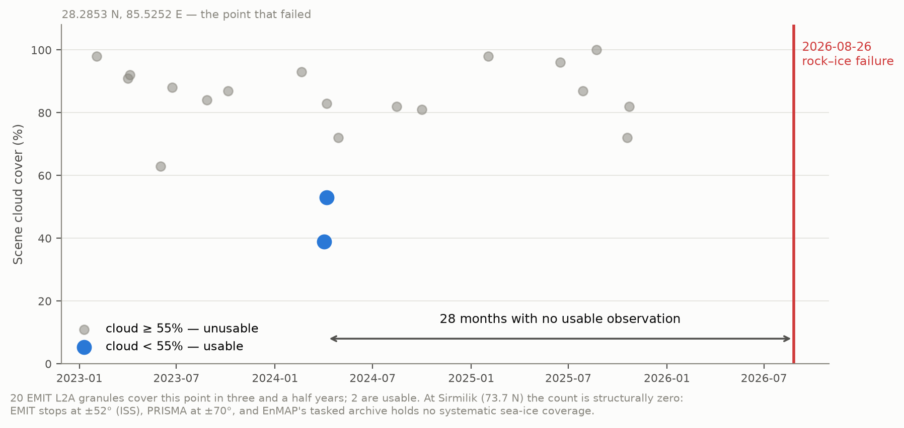
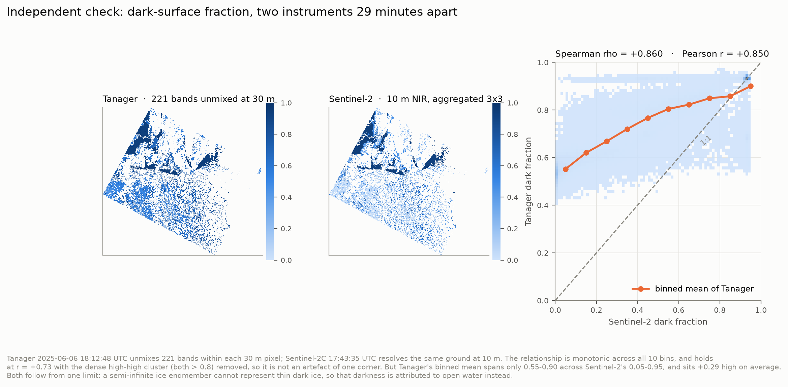

# The open hyperspectral archive has no glaciers in it

### A calibrated cryosphere retrieval for Tanager-1, and the case for pointing it at ice

**Tanager Open Data Competition 2026** · Scene `20250606_181248_58_4001`, Sirmilik National
Park, Nunavut · Code, weights, figures and a script that re-checks the headline numbers
below: see Project Materials.

---

## 1 · The gap

On **26 August 2026** a combined rock and ice slope failure on the north side of Langtang
Lirung, Nepal, sent bedrock and glacier ice into the Lhende Khola. The debris temporarily
dammed the river; the impoundment breached, and the flood ran nearly 100 km down the Bhote
Koshi and Trishuli, destroying the Gyirong border crossing. As of 29 August more than 600
people were confirmed dead and more than 1,900 were missing in Nepal, with further deaths
in Gyirong County, Tibet; the toll is still rising.

Two things it was not. Not a glacial lake outburst flood — no pre-existing lake failed.
And not a clean glacier detachment of the 2016 Aru type: the scar shows a large volume of
both ice **and** rock removed. This is the rock–ice avalanche class, the failure mode that
is becoming more common as high-mountain permafrost degrades and the bedrock holding ice
onto steep faces loses its cement.

That class is not a Himalayan problem; it occurs wherever ice sits on a steep slope, and part
of its preconditioning is cryospheric and therefore spectral — grain coarsening, liquid water,
impurity-driven albedo loss all change how much energy the ice absorbs. So we asked how often
a spaceborne imaging spectrometer has looked at the slope that failed.

**Twice in three and a half years.** Of 20 EMIT L2A granules containing the source zone
(28.2853 N, 85.5252 E), two fall below 55% cloud. The last usable look came **28 months
before the failure**. The result is insensitive to which of the two published source
positions is used — they differ by 1.1 km, an EMIT granule is ~75 km across, and both
return the same 20 granules and the same 28-month gap.

At 73 N the number is not small but structural: **zero**. EMIT flies on the ISS, which
reaches only ±52°; PRISMA acquires only within ±70°; EnMAP's proposal-driven archive holds
no systematic sea-ice coverage. No spaceborne imaging spectrometer systematically observes
the Arctic sea-ice zone. And querying all **153 scenes** of the Tanager Open STAC catalogue
(as of 29 August 2026) against the OpenStreetMap glacier layer returns **zero
intersections**. The open archive contains no glacier.

That absence is the argument, and the prize is what can fix it.

## 2 · What we built, and the Tanager feature that made it possible

Since the archive has no glacier, we built and validated the retrieval on the cryosphere
data that does exist — Arctic sea ice in melt. `tanager-cryo` inverts Tanager reflectance
into sub-pixel fractions of solid ice/snow, melt pond and open water; the effective
absorption length that sets grain size; pond depth; and impurity load. Scenes are read
through Planet's own `xarray-hyperspectral` backend.

Forward model: Kokhanovsky–Zege asymptotic radiative transfer for the solid surface, a
two-way Beer–Lambert water column over a scattering floor for ponds, ice constants from
Warren & Brandt (2008), water from Segelstein (1981). There is no field campaign at
Sirmilik on 2025-06-06, so rather than invent labels the network trains on 150,000 spectra
from that forward model — standard practice when validation data are absent — and the
honesty is pushed into the uncertainty instead.

**The decisive Tanager feature is `surface_reflectance_uncertainty`**, the per-pixel,
per-band 1σ most workflows read past. We used it three times:

1. **Band selection.** The scene's own SNR spectrum runs 55–235 below 1350 nm and collapses
   to 3–16 beyond 2000 nm, where ice absorption drives reflectance to the noise floor.
   Cutting at SNR > 30 keeps 221 bands and lifted the synthetic training distribution's
   coverage of observed spectra from **92.4% to 99.7%**. Derived, not assumed.
2. **Noise model.** Training spectra are perturbed by the measured per-band σ, with a
   per-sample scale so the network must *use* the σ rather than ignore a constant.
3. **Error budget**, below.

The network emits a predictive variance per parameter under a Gaussian NLL. This matters
because three of six parameters are only *conditionally* identifiable — pond depth is
meaningless where there is no pond. A point estimator returns confident nonsense there.

## 3 · Accuracy, calibration, and why neither was enough

On 30,000 held-out synthetic spectra: melt pond fraction RMSE 0.0062, snow/ice 0.0165,
open water 0.0185, and — evaluated where the host endmember is present — absorption length
(log₁₀ m) 0.0224, **melt pond depth 10.1 mm**, impurity load 5.62. Across all six parameters
the variance of the standardised residual is **1.05–1.08** against a nominal 1.0, with 68%
and 95% coverage at 0.65–0.70 and 0.94–0.96 against nominal 0.683 and 0.950 — the usual
failure of a heteroscedastic network, severe unflagged overconfidence, is reduced here to a
quantified few per cent.

Those are the numbers after the correction described in §4. Before it, the same tables read
better — pond fraction RMSE 0.0030, R² = 1.000 on every parameter, calibration equally
clean. **The flattering version was wrong, and no synthetic test could have told us.**

## 4 · The check that caught it

Sentinel-2C imaged this scene at 17:43:35 UTC on 2025-06-06; Tanager at 18:12:48. **Twenty-nine
minutes apart.** Both products sit in EPSG:32617 and Tanager's 30 m pixel edges fall on
Sentinel-2's 10 m grid lines, so every Tanager pixel contains exactly 3×3 Sentinel-2 pixels
with no resampling anywhere in the comparison. Tanager infers the sub-pixel fractions
*spectrally*, by unmixing; Sentinel-2 resolves them *spatially*. Different information
channel, same ground, same minute.

(ICESat-2 was the first choice — an active laser is a cleaner reference. All three tracks
crossing this scene in June 2025 are flagged 100% cloud-covered, every height a fill value.
The Arctic is hard to observe from orbit; that is the theme of this memo.)

The first comparison came back **anti-correlated**: r = −0.68 on the solid fraction. A
green-band cross-check ruled out geometry — Tanager and Sentinel-2 green agree at r = 0.814
with zero offset, and a shift test confirms the alignment. The disagreement was real, and
its cause was a domain gap invisible from inside the synthetic world: Tanager's instrument σ
is 0.0013, but the forward model reproduces real sea-ice reflectance only to about 0.03. The
network had been trained under noise up to 0.005 and was being asked, at inference, to
interpret spectra deviating from its training manifold by five times that.

White noise at the right amplitude would have been the wrong repair — it teaches a network
to be uncertain, not robust, and forward-model error is not white but a smooth bias in
spectral *shape*. Training was reworked to inject smooth perturbations built from low-order
Legendre polynomials, scaled to that measured 0.03. The perturbations are 16× smoother
band-to-band than white noise of the same amplitude, and lifted synthetic coverage of the
observed spectra the last of the way, 99.7% to 100%. Synthetic scores got worse, as they should. The comparison
with Sentinel-2 flipped sign.

**Where it now stands.** Spearman ρ = **+0.860** on the dark-surface fraction, monotonic
across all ten bins, and still r = +0.73 with the dense high-high cluster removed — not an
artefact of one corner. But the binned mean of Tanager spans only 0.55–0.90 across
Sentinel-2's 0.05–0.95, and reads **+0.29 high** on average.

That residual disagreement is a physical limit, not a bug, and we chased it far enough to
say so. Over pixels Sentinel-2 resolves as continuous ice, the observed spectrum has exactly
the *shape* of the semi-infinite model at half its amplitude: the observed/modelled ratio is
0.52 at 421 nm and 0.52 at 1032 nm. A grey darkening like that is what thin ice over dark
ocean produces — and it is mathematically indistinguishable from mixing in open water. We
implemented a finite-thickness ice endmember to separate them; it bought no identifiability,
only a relabelling, and its transmittance shape fits the observations at RMSE 0.195. **At
30 m, passive optics cannot separate open water from thin dark ice.** The retrieval's
"open water" is really a dark-surface fraction, and we report it as such.

## 5 · A real scene, including where it fails

Sirmilik, 2025-06-06: 332,535 valid pixels. Medians 0.28 solid, 0.16 pond, 0.56 dark
surface, pond depth 0.05 m — read the dark fraction with §4 in mind.

We do not trust a network that returns a number for every pixel. Retrieved parameters are
pushed back through the forward model and compared to the observation under a combined
error budget. That exposed the most useful number in this work:

> **Forward-model error 0.0354 in reflectance; Tanager instrument σ 0.0013.
> The retrieval is forward-model limited by a factor of 27.**

Tanager resolves structure a three-endmember model cannot yet exploit. Weighting the fit by
instrument σ alone rejects every pixel, because it asks a 3.5% model to agree with a 0.1%
measurement. With both terms, **30.1%** of pixels are explained at χ²ᵥ ≤ 4. What is rejected
is largely the snow-covered **land** in the south of the scene, which an ice model has no
business describing — the goodness-of-fit panel finds that boundary unaided.

## 6 · What the spectrum buys

Sentinel-2 is the right comparison for polar work: free, near-daily at 73 N, and the sensor
operational sea-ice products run on. EMIT cannot be compared at all — it cannot see this
latitude. We degrade Tanager to Sentinel-2's 10 L2A bands with the official ESA response
functions (COPE-GSEG-EOPG-TN-15-0007), holding scenes, forward model, architecture,
schedule and seeds fixed. Noise propagation favours Sentinel-2, so these are lower bounds.

| Quantity | Penalty for using Sentinel-2's bands |
|---|---|
| **Grain size (log₁₀ L)** | **13.1×** |
| Impurity load | 5.5× |
| Melt pond fraction | 5.2× |
| Snow / ice fraction | 4.8× |
| Open water fraction | 4.1× |
| Melt pond depth | 1.8× |

Grain size degrades most because it lives in the ice absorption features at 1030 and
1240 nm, and Sentinel-2 L2A has nothing between 865 and 1614 nm. Pond depth degrades least,
1.8×, because Sentinel-2 does carry six red/near-infrared bands — we report that rather
than round it away.

## 7 · Limits we are not hiding

Sea ice is an **analogue, not the target**; the archive gave no alternative, and that is the
point. The retrieved **"open water" is a dark-surface fraction** that includes thin ice, per
§4; treat it as such. The per-class check is weaker still for ponds: against a hard
Sentinel-2 classification, whose thresholds score partially wet 10 m pixels as dry, the
pond fraction anti-correlates (r = −0.34); only the combined dark fraction supports a clean
cross-instrument comparison, which is why §4 reports that. **Impurity load should be read with caution** — the forward model runs
0.03–0.06 dark in the visible and this parameter is best placed to absorb that bias. Grain
diameter converts from absorption length through a stated shape factor (B = 3.62), carried
as a file attribute. Coarse-resolution pond retrieval is a mature field (MERIS, MODIS,
OLCI); what is new here is **spaceborne 30 m with calibrated per-pixel uncertainty and an
independent same-day cross-check**.

And the honest scoping point: Langtang was a **rock–ice** failure. This retrieval
characterises the ice, not the bedrock or the permafrost that also gave way. It addresses
one component of the preconditioning, not the whole of it. We would rather say that than
imply a cryosphere product forecasts rock-slope stability.

Tanager's revisit does not support **early warning** and we do not claim it. It supports
preconditioning and susceptibility mapping.

## 8 · With more Tanager data

Point it at ice. The tool is built, validated and calibrated; the archive has no glacier to
run it on. Ten tasked scenes over glaciated hazard corridors — Langtang and the Bhote Koshi
above Gyirong first, then Cordillera Real above La Paz, the Karakoram, the Caucasus — would
convert a validated Arctic retrieval into a preconditioning baseline for terrain that is
actively killing people. Repeat coverage of Sirmilik across a melt season would give the
30 m pond-evolution time series no spaceborne spectrometer has ever acquired.
