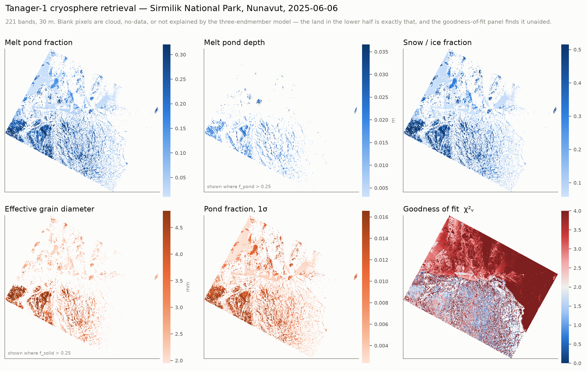
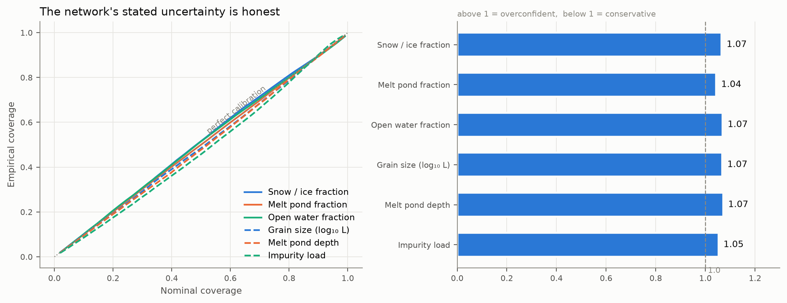
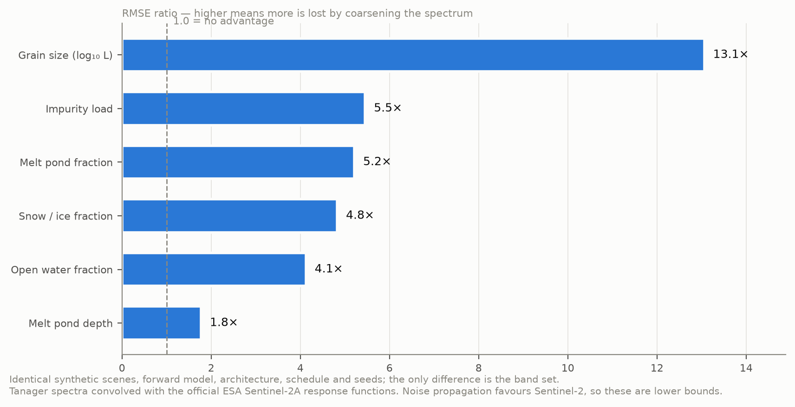
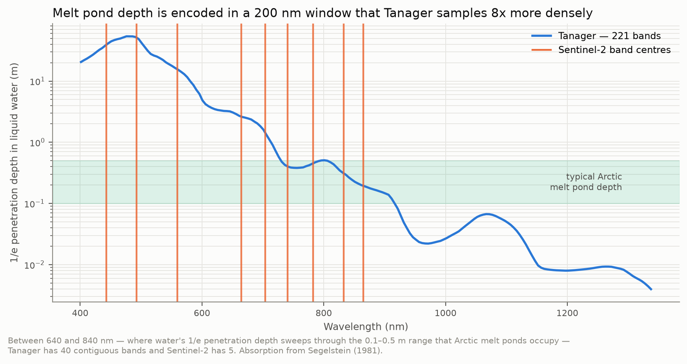

# tanager-cryo

**A calibrated cryosphere retrieval for Planet Tanager-1 — and the case for pointing it at ice.**

Submission to the Planet Tanager Open Data Competition 2026.

---

## The finding this is built on

On **26 August 2026** a combined **rock and ice** slope failure on Langtang Lirung, Nepal,
sent bedrock and glacier ice into the Lhende Khola. The debris dammed the river; the
impoundment breached and the flood ran ~100 km, destroying the Gyirong border crossing.
As of 29 August more than 600 people were confirmed dead and more than 1,900 were missing
in Nepal, with further deaths in Gyirong County, Tibet; the toll is still rising.

It was neither a glacial lake outburst flood nor a clean glacier detachment — the scar
shows both ice *and* rock removed. This is the rock–ice avalanche class, increasingly
common as high-mountain permafrost degrades.

We asked how often a spaceborne imaging spectrometer had actually looked at that slope.

| | |
|---|---|
| EMIT L2A granules covering the source zone (28.2853 N, 85.5252 E) | 20 |
| Of those, usable at < 55% cloud | **2** |
| Last usable observation before the failure | **2024-04-06 — 28 months** |
| EMIT observations of Sirmilik, 73.7 N | **0, structurally** — the ISS reaches only ±52° |
| Tanager Open STAC scenes intersecting a mapped glacier (all 153 as of 2026-08-29, via OSM/Overpass) | **0** |

**The open hyperspectral archive contains no glacier.** That absence is the argument, and
the prize — winners select which Tanager images enter the open catalogue — is what can fix it.


## What this repository contains

A retrieval that inverts Tanager surface reflectance into six physical quantities with a
**calibrated uncertainty on every one**, demonstrated on the cryosphere data that does
exist — Arctic sea ice in melt, Sirmilik National Park, Nunavut, 2025-06-06.

- sub-pixel fractions of solid ice/snow, melt pond, open water
- effective absorption length (→ grain size)
- melt pond depth
- light-absorbing particle load



## Results

**Accuracy** on 30,000 held-out synthetic spectra, conditioned on the host endmember present:

| Quantity | RMSE |
|---|---|
| Melt pond fraction | 0.0062 |
| Snow / ice fraction | 0.0165 |
| Open water fraction | 0.0185 |
| Absorption length (log₁₀ m) | 0.0224 |
| Melt pond depth | **10.1 mm** |
| Impurity load | 5.62 |

**Calibration.** Variance of the standardised residual is **1.05–1.08** against a nominal
1.0 across all six parameters; empirical 68% and 95% coverage land on 0.65–0.70 and
0.94–0.96 against nominal 0.683 and 0.950. The usual failure of a heteroscedastic network,
severe unflagged overconfidence, is reduced here to a quantified few per cent.



## The check that caught a real error

An earlier version of this model scored **better** on every synthetic test — pond fraction
RMSE 0.0030, R² = 1.000 throughout. It was wrong, and no synthetic test could have shown it.

Sentinel-2C imaged this scene **29 minutes** after Tanager on 2025-06-06. Both sit in
EPSG:32617 with Tanager's 30 m pixel edges on Sentinel-2's 10 m grid lines, so every Tanager
pixel holds exactly 3×3 Sentinel-2 pixels — no resampling anywhere. Tanager infers the
fractions *spectrally*; Sentinel-2 resolves them *spatially*.

The first comparison came back **anti-correlated at r = −0.68**. A green-band cross-check
(r = 0.814, zero offset) ruled out geometry. The cause was a domain gap: Tanager's instrument
σ is 0.0013, but the forward model reproduces real sea-ice reflectance only to ~0.03 — the
network had been trained under noise up to 0.005 and was extrapolating at inference.

The repair was not white noise, which teaches a network to be uncertain rather than robust.
Forward-model error is a smooth bias in spectral *shape*, so training now injects smooth
perturbations from low-order Legendre polynomials, 16× smoother band-to-band than white
noise of the same amplitude. Synthetic scores got worse. The Sentinel-2 comparison flipped
sign.


**Where it stands:** Spearman ρ = **+0.860**, monotonic across all ten bins, still r = +0.73
with the dense cluster removed. But the binned mean of Tanager spans 0.55–0.90 across
Sentinel-2's 0.05–0.95, reading +0.29 high. That residual is a physical limit: over pixels Sentinel-2
resolves as continuous ice, the observed spectrum has the *shape* of the semi-infinite model
at half its amplitude (ratio 0.52 at both 421 and 1032 nm). Such a grey darkening is what
thin ice over dark ocean produces, and it is indistinguishable from mixing in open water.
**At 30 m, passive optics cannot separate the two.** The retrieved "open water" is a
dark-surface fraction, and is reported as one.

(ICESat-2 was tried first — all three tracks crossing this scene in June 2025 are flagged
100% cloud-covered.)

**Against Sentinel-2**, degrading Tanager to the 10 L2A surface bands with the official ESA
response functions and holding scenes, forward model, architecture, schedule and seeds fixed:



Grain size degrades 13× because it lives in the ice absorption features at 1030 and 1240 nm,
and Sentinel-2 L2A has nothing between 865 and 1614 nm.

**Against EMIT and PRISMA**, which cannot acquire this latitude (±52° and ±70°), the same
protocol run on their *band sets* — Gaussian response functions at the published
7.4 nm sampling / 8.5 nm FWHM (EMIT) and 11 nm / 12 nm (PRISMA), `experiment_hsi.py` —
leaves retrieval skill statistically unchanged: RMSE ratios **0.95–1.03** across all six
parameters (`5_outputs/sensor_comparison_hsi.json`). The Arctic observation gap is
**orbital, not spectral**: the cliff sits between multispectral and imaging spectroscopy,
and the imaging spectrometer that can reach the Arctic is Tanager.

## The Tanager feature that made the difference



Every scene ships `surface_reflectance_uncertainty` — a per-pixel, per-band 1σ that most
workflows read past. It is used three times here:

1. **Band selection.** The scene's own SNR spectrum runs 55–235 below 1350 nm and collapses
   to 3–16 beyond 2000 nm. Cutting at SNR > 30 keeps 221 bands and lifted the synthetic
   training distribution's coverage of observed spectra from **92.4% → 99.7%**.
2. **Noise model.** Training spectra are perturbed by the measured per-band σ, with a
   per-sample scale so the network must learn to *use* the σ rather than ignore a constant.
3. **Error budget.** It enters the goodness-of-fit test — and exposed the most useful number
   we found:

> The forward-model error is **0.0354** in reflectance. Tanager's instrument σ is **0.0013**.
> **The retrieval is forward-model limited by a factor of 27.**
>
> Tanager resolves structure that a three-endmember model cannot yet exploit.

## Honest limits

- The demonstration is **sea ice, not glacier ice**. Shared radiative physics; not the target.
- Langtang was a **rock–ice** failure. This retrieval characterises the ice, not the bedrock
  or permafrost that also gave way — one component of the preconditioning, not all of it.
- Accuracy against synthetic truth constrains self-consistency only; the Sentinel-2 check
  above is what bounds agreement with the real surface.
- The retrieved **"open water" is a dark-surface fraction** including thin ice — see above.
- Against the hard Sentinel-2 classification — whose thresholds score partially wet 10 m
  pixels as dry — the **pond fraction anti-correlates (r = −0.34)**; only the combined dark
  fraction supports a clean cross-instrument comparison. The per-class numbers are in
  `5_outputs/s2_validation.json`.
- The glacier audit uses OpenStreetMap, which is not a complete glacier inventory; the
  audit script says so, and the analysed scene was additionally checked by inspection.
- **Impurity load should be read with caution** — the forward model runs ~0.03–0.06 dark in
  the visible and this parameter is best placed to absorb that bias.
- Melt pond retrieval at coarse resolution is a mature field (MERIS, MODIS, OLCI). What is
  new is **spaceborne 30 m with calibrated per-pixel uncertainty**.
- This does **not** support early warning and we do not claim it. A glacial lake can be
  watched for years; a rock–ice slope gives minutes — which is exactly why the monitorable
  quantity is the preconditioning. The Lhende Khola valley has now flooded twice in
  thirteen months by two different mechanisms (a supraglacial-lake outburst in July 2025,
  this rock–ice failure in August 2026).

## Run it in one notebook

[`2_notebooks/TANAGER_03_train_exp001_cryo_retrieval_e2e.ipynb`](2_notebooks/TANAGER_03_train_exp001_cryo_retrieval_e2e.ipynb)
walks the whole submission end to end: the observation gap, the glacier audit, band
selection, forward-model sanity checks, training, calibration, the retrieval, the
Sentinel-2 cross-check, the sensor comparison, the figures, and a final pass that
re-verifies the memo's headline numbers.

**It needs no credentials.** Tanager scenes are on public Google Cloud Storage,
Sentinel-2 L2A on public AWS COGs, and the coverage audit uses NASA CMR — all
unauthenticated. Set `DRY_RUN = False` for the full run (~25 min, mostly downloading);
leave it `True` for a ~3 min pass that exercises every code path at reduced size and
writes to `_dryrun`-suffixed files so it cannot overwrite the committed results.

## Install and reproduce

```bash
python -m venv .venv && source .venv/bin/activate
pip install -r requirements.txt
```

Scene data is public and needs no authentication:

```bash
python -m tanager_cryo.fetch --scene 20250606_181248_58_4001    # ~883 MB
```

Then, in order:

```bash
export PYTHONPATH=3_src
python -m tanager_cryo.train           # ~4 min on Apple silicon (MPS)
python -m tanager_cryo.evaluate        # accuracy + calibration
python -m tanager_cryo.retrieve --scene 1_data/raw/sirmilik/20250606_181248_58_4001_sr.h5 \
                                --out   5_outputs/sirmilik_retrieval.nc
python -m tanager_cryo.experiment_s2   # Tanager vs Sentinel-2
python -m tanager_cryo.experiment_hsi  # Tanager vs the EMIT / PRISMA band sets
python -m tanager_cryo.observation_gap # EMIT coverage of the Langtang source zone
python -m tanager_cryo.glacier_check   # optional, ~10 min: full-catalogue glacier audit
python -m tanager_cryo.s2_validate --s2-json 1_data/raw/s2_item.json   # independent check
python -m tanager_cryo.figures         # all six figures
python -m tanager_cryo.verify          # re-checks the memo's headline numbers
```

Scenes are read through Planet's own [`xarray-hyperspectral`](https://github.com/planetlabs/xarray-hyperspectral)
backend, not a bespoke reader.

## Layout

```
3_src/tanager_cryo/
  optics.py            ice (Warren & Brandt 2008) + water (Segelstein 1981) constants
  forward.py           Kokhanovsky-Zege ART, melt-pond water column, linear mixing
  synth.py             synthetic training set; uncertainty-driven band selection
  model.py             heteroscedastic MLP (mean + predictive variance)
  train.py             training
  evaluate.py          accuracy, conditional accuracy, calibration
  residual.py          forward-reconstruction goodness of fit; combined error budget
  retrieve.py          apply to a scene -> georeferenced NetCDF with uncertainty
  s2compare.py         ESA Sentinel-2A SRF convolution
  experiment_s2.py     controlled degradation experiment vs Sentinel-2
  experiment_hsi.py    the same experiment vs the EMIT and PRISMA band sets
  observation_gap.py   EMIT coverage audit via NASA CMR
  glacier_check.py     full-catalogue glacier audit via OSM Overpass
  s2_validate.py       independent validation against same-day Sentinel-2 at 10 m
  figures.py           all figures
  viz.py               figure style and palette
2_notebooks/           end-to-end notebook + its spec
1_data/                optical constants, band selection, DATA_AVAILABILITY.md
4_models/              trained weights (~0.9 MB) + metadata
5_outputs/             retrieval NetCDF, JSON results, figures
6_papers/submission/   technical memo, form answers
```

## Sources

Ice optical constants: Warren & Brandt (2008), *J. Geophys. Res.* 113, D14220.
Liquid water: Segelstein (1981), MSc thesis, UMKC.
Snow ART: Kokhanovsky & Zege (2004); Kokhanovsky et al. (2019, Sentinel-3 SICE).
Sentinel-2 response functions: ESA COPE-GSEG-EOPG-TN-15-0007.
Tanager imagery: Tanager STAC Data, available at www.planet.com/data/stac,
© 2025 Planet Labs PBC, used under CC-BY 4.0. The retrieval maps and NetCDF products
here are derived from (i.e. modify) that imagery.

## Licence

Code: Apache-2.0 (see `LICENSE`). Derived data products: CC-BY 4.0, consistent with
the Tanager Open STAC licence.
